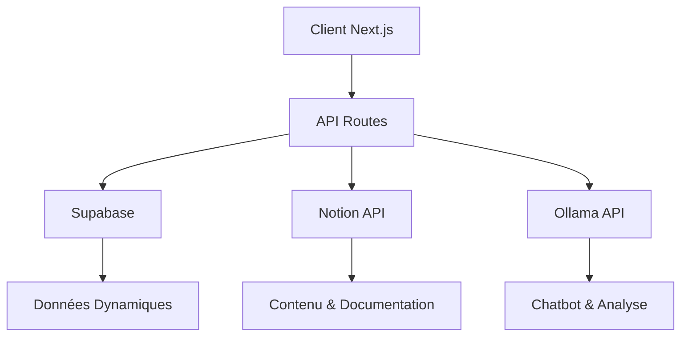

# Architecture StoaViva

## Vue d'Ensemble

StoaViva utilise une architecture moderne combinant trois services complémentaires :

1. **Supabase** : Base de données principale et temps réel
2. **Notion** : CMS et gestion de contenu
3. **Ollama** : Intelligence artificielle conversationnelle



## Répartition des Responsabilités

### 1. Supabase (Données Dynamiques)

```typescript
// lib/supabase.ts
interface StockMovement {
  product_id: string;
  quantity: number;
  type: 'in' | 'out';
  timestamp: Date;
}

interface EventRegistration {
  event_id: string;
  user_id: string;
  status: 'pending' | 'confirmed' | 'cancelled';
}

// Temps réel pour le stock
const subscribeToStock = (productId: string) => {
  return supabase
    .from('stock_movements')
    .on('INSERT', payload => {
      // Mise à jour UI
    })
    .subscribe();
};

// Authentification utilisateurs
const signIn = async (email: string, password: string) => {
  return supabase.auth.signIn({ email, password });
};
```

### 2. Notion (Gestion de Contenu)

```typescript
// lib/notion.ts
interface Product {
  id: string;
  name: string;
  description: string;
  category: string;
  ecoImpact: {
    score: number;
    details: string[];
  };
}

interface Service {
  id: string;
  title: string;
  description: string;
  duration: number;
  benefits: string[];
}

// Synchronisation Notion -> Supabase
const syncProducts = async () => {
  const products = await notion.databases.query({
    database_id: process.env.NOTION_PRODUCTS_DB_ID
  });
  
  // Mise à jour cache Supabase
  await supabase.from('products_cache').upsert(
    products.map(formatNotionProduct)
  );
};
```

### 3. Ollama (IA Conversationnelle)

```typescript
// lib/ollama.ts
interface ChatContext {
  products?: Product[];
  services?: Service[];
  userProfile?: UserProfile;
}

// Intégration avec Notion et Supabase
const generateResponse = async (
  message: string,
  context: ChatContext
) => {
  // Enrichir le contexte
  const stockLevels = await supabase
    .from('current_stock')
    .select('*');
    
  const notionContent = await notion.databases
    .query({
      database_id: process.env.NOTION_PRODUCTS_DB_ID
    });

  return ollama.chat({
    model: 'codestral:latest',
    messages: [{
      role: 'system',
      content: formatContext({
        ...context,
        stock: stockLevels,
        products: notionContent
      })
    }, {
      role: 'user',
      content: message
    }]
  });
};
```

## Configuration

```env
# Supabase
NEXT_PUBLIC_SUPABASE_URL=your-project.supabase.co
NEXT_PUBLIC_SUPABASE_ANON_KEY=your-anon-key
SUPABASE_SERVICE_ROLE_KEY=your-service-key

# Notion
NOTION_API_KEY=your-notion-key
NOTION_PRODUCTS_DB_ID=your-db-id
NOTION_SERVICES_DB_ID=your-db-id

# Ollama
OLLAMA_API_URL=http://localhost:11434
OLLAMA_MODEL=codestral:latest
```

## Flux de Données

1. **Produits & Services**
   - Gestion dans Notion (descriptions, images, catégories)
   - Synchronisation vers Supabase pour le cache
   - Stock en temps réel dans Supabase

2. **Utilisateurs & Commandes**
   - Authentification via Supabase
   - Profils et préférences dans Supabase
   - Historique des commandes en temps réel

3. **Chatbot & Assistance**
   - Interface utilisateur Next.js
   - Contexte enrichi depuis Notion et Supabase
   - Réponses générées par Ollama

## Bonnes Pratiques

1. **Performance**
   - Cache des données Notion dans Supabase
   - Optimistic UI pour les mises à jour
   - Pagination et lazy loading

2. **Sécurité**
   - Row Level Security dans Supabase
   - Validation des entrées côté serveur
   - Tokens d'API sécurisés

3. **Maintenance**
   - Scripts de synchronisation automatisés
   - Monitoring des services
   - Sauvegardes régulières

## Évolution Future

1. **Intégration**
   - Webhooks Notion -> Supabase
   - Fine-tuning Ollama
   - API publique

2. **Fonctionnalités**
   - Analyse prédictive des stocks
   - Recommandations personnalisées
   - Chat multilingue
