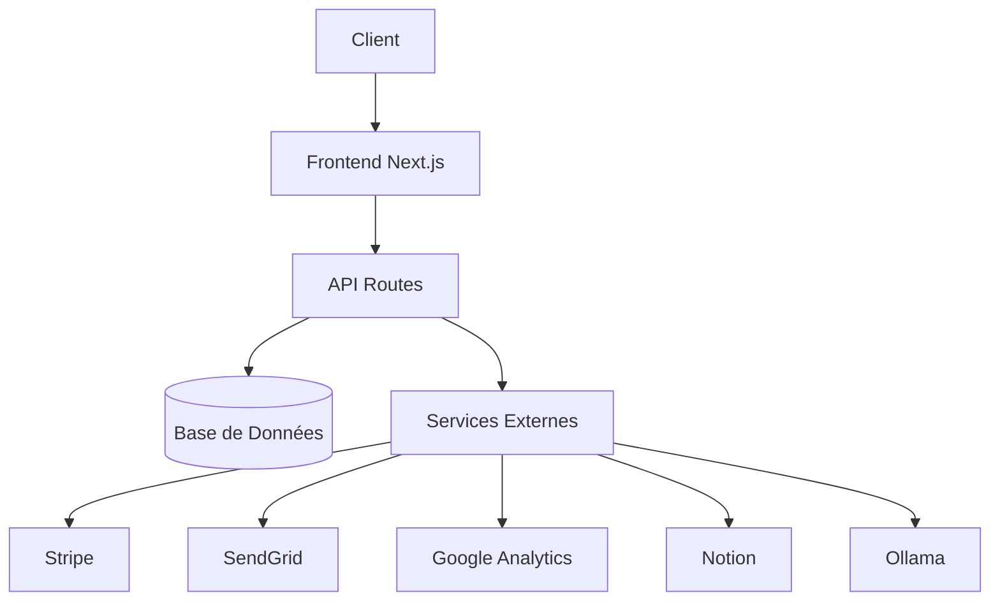

# Architecture Technique de StoaViva

## Vue d'ensemble
StoaViva est une application web combinant une boutique en ligne de produits écologiques et une plateforme de services à la personne. Cette documentation détaille l'architecture technique nécessaire pour implémenter les fonctionnalités requises.

## Diagramme d'Architecture


## Structure de l'Application

### 1. Frontend (Next.js + Tailwind CSS)

#### Pages Principales
- **Page d'Accueil** (`/src/app/page.tsx`)
  - Hero section avec présentation du concept
  - Navigation rapide vers Produits/Services
  - Sections featured pour produits et services populaires

- **Catalogue Produits** (`/src/app/produits/page.tsx`)
  - Filtres dynamiques (catégories, prix)
  - Grille de produits responsive
  - Système de pagination/infinite scroll

- **Services** (`/src/app/services/page.tsx`)
  - Catalogue des services disponibles
  - Système de réservation
  - Calendrier interactif

#### Composants Réutilisables
- **ProductCard** (`/src/components/ProductCard.tsx`)
  - Affichage des informations produit
  - Actions rapides (ajout panier)
  - Optimisation images avec Next/Image

- **ServiceCard** (`/src/components/ServiceCard.tsx`)
  - Présentation des services
  - Bouton de réservation rapide
  - Indicateur de disponibilité

- **Layout** (`/src/app/layout.tsx`)
  - Navigation principale
  - Panier/Compte utilisateur
  - Footer avec informations importantes

### 2. Backend (API Routes Next.js)

#### API Endpoints

```typescript
// Produits
/api/products
  GET    - Liste des produits avec filtres
  POST   - Ajout d'un nouveau produit (admin)
  
/api/products/[id]
  GET    - Détails d'un produit
  PUT    - Mise à jour produit
  DELETE - Suppression produit

// Services
/api/services
  GET    - Liste des services disponibles
  POST   - Création nouveau service

/api/services/[id]/availability
  GET    - Créneaux disponibles
  POST   - Réserver un créneau

// Utilisateurs
/api/users
  POST   - Création compte
  GET    - Infos utilisateur

/api/users/orders
  GET    - Historique commandes
  POST   - Nouvelle commande
```

### 3. Base de Données (Schema Prisma)

```prisma
// Produits
model Product {
  id          String   @id @default(cuid())
  name        String
  description String
  price       Float
  category    Category @relation(fields: [categoryId], references: [id])
  categoryId  String
  stock       Int
  images      String[]
  createdAt   DateTime @default(now())
  updatedAt   DateTime @updatedAt
}

// Services
model Service {
  id          String   @id @default(cuid())
  name        String
  description String
  duration    Int      // en minutes
  price       Float
  capacity    Int      // nombre max de participants
  category    String
  bookings    Booking[]
}

// Réservations
model Booking {
  id        String   @id @default(cuid())
  service   Service  @relation(fields: [serviceId], references: [id])
  serviceId String
  user      User     @relation(fields: [userId], references: [id])
  userId    String
  date      DateTime
  status    String   // confirmed, cancelled, completed
}

// Utilisateurs
model User {
  id        String    @id @default(cuid())
  email     String    @unique
  name      String?
  orders    Order[]
  bookings  Booking[]
  createdAt DateTime  @default(now())
}
```

### 4. Intégrations Externes

#### Paiement
- Stripe pour le traitement des paiements
- PayPal comme option alternative

#### Authentification
- NextAuth.js pour la gestion des sessions
- Providers : Email/Password, Google, Facebook

#### Emails
- SendGrid pour les notifications
- Templates pour :
  - Confirmation de commande
  - Rappel de réservation
  - Newsletter

#### Notion
- Base de données pour la gestion des produits et services
- Synchronisation des données via API
- Gestion des contenus dynamiques

#### Ollama
- Modèles de langage pour :
  - Analyse des avis clients
  - Génération de contenu
  - Assistance conversationnelle

### 5. Fonctionnalités Avancées

#### Système de Recommandations
```typescript
// Logique de recommandation produits/services
interface Recommendation {
  type: 'product' | 'service';
  baseItem: string;  // ID du produit/service acheté
  recommendations: Array<{
    id: string;
    type: 'product' | 'service';
    relevanceScore: number;
  }>;
}
```

#### Programme de Fidélité
```typescript
interface LoyaltyProgram {
  userId: string;
  points: number;
  tier: 'bronze' | 'silver' | 'gold';
  history: Array<{
    date: Date;
    action: string;
    points: number;
  }>;
}
```

### 6. Optimisations

#### Performance
- Images optimisées via Next/Image
- Mise en cache des données statiques
- Lazy loading des composants

#### SEO
- Métadonnées dynamiques
- Sitemap automatique
- Schema.org markup

#### Analytics
- Google Analytics
- Hotjar pour le comportement utilisateur
- Rapports de conversion

## Déploiement

### Infrastructure
- Vercel pour l'hébergement
- PostgreSQL sur Supabase
- CDN pour les assets statiques

### CI/CD
- GitHub Actions pour les tests
- Déploiement automatique sur Vercel
- Monitoring avec Sentry

## Roadmap Technique

### Phase 1 (MVP)
- [x] Setup Next.js avec Tailwind
- [x] Création des composants de base
- [x] Intégration Stripe
- [x] Système d'authentification
- [x] Intégration Notion
- [x] Intégration Ollama

### Phase 2
- [ ] Système de réservation
- [ ] Programme de fidélité
- [ ] Recommandations produits/services

### Phase 3
- [ ] Chat en direct
- [ ] Application mobile
- [ ] Internationalisation
