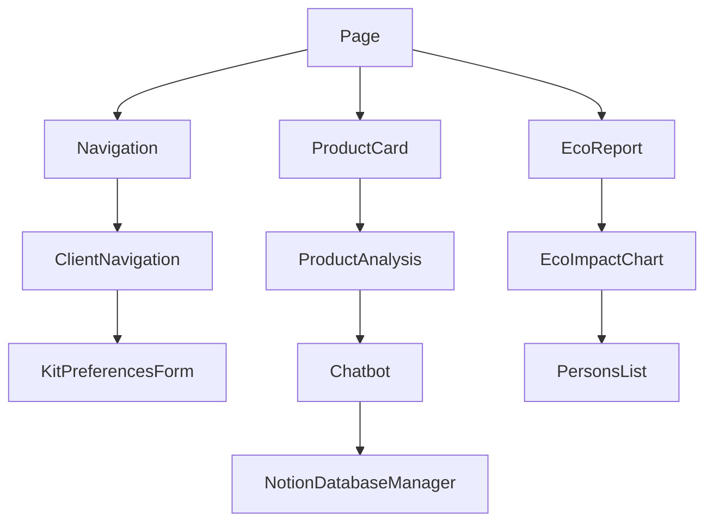

# Documentation des Composants

## Architecture des Composants



## Composants Principaux

### 1. Navigation
[`Navigation.tsx`](../src/components/Navigation.tsx)

**Fonctionnalités :**
- Gestion de la navigation principale
- Liens vers les pages principales
- Gestion des états actifs
- Responsive design
- Intégration avec le système de routage

**Exemple d'utilisation :**
```typescript
function App() {
  return (
    <Navigation
      currentPath="/"
      links={[
        { path: "/", label: "Accueil" },
        { path: "/products", label: "Produits" },
        { path: "/analysis", label: "Analyse" }
      ]}
    />
  );
}
```

**Tests Unitaires :**
```typescript
describe('Navigation', () => {
  it('should highlight active link', () => {
    const { getByText } = render(
      <Navigation currentPath="/products" links={[
        { path: "/", label: "Home" },
        { path: "/products", label: "Products" }
      ]}/>
    );
    
    expect(getByText('Products').parentElement).toHaveClass('active');
  });
});
```

### 2. ProductCard
[`ProductCard.tsx`](../src/components/ProductCard.tsx)

**Fonctionnalités :**
- Affichage des informations produit
- Gestion des interactions utilisateur
- Intégration avec le système de notation
- Affichage des analyses écologiques

**Exemple d'utilisation :**
```typescript
function ProductList({ products }) {
  return (
    <div>
      {products.map(product => (
        <ProductCard
          key={product.id}
          product={product}
          onSelect={handleProductSelect}
        />
      ))}
    </div>
  );
}
```

**Tests Unitaires :**
```typescript
describe('ProductCard', () => {
  it('should display product name', () => {
    const product = { id: 1, name: 'Test Product' };
    const { getByText } = render(<ProductCard product={product} />);
    expect(getByText('Test Product')).toBeInTheDocument();
  });
});
```

### Chatbot
[`Chatbot.tsx`](../src/components/Chatbot.tsx) | [Documentation détaillée](chatbot.md)

**Fonctionnalités :**
- Interface de chat interactive
- Intégration avec Notion et Ollama
- Gestion avancée des bases de données Notion
- Support pour fichiers et images
- Commandes personnalisées

**Exemple d'utilisation :**
```typescript
function App() {
  return (
    <div>
      <Chatbot
        defaultModel="llama2"
        theme="light"
        position="right"
      />
    </div>
  );
}
```

**Tests Unitaires :**
```typescript
describe('Chatbot', () => {
  it('should process notion commands', async () => {
    const { getByText } = render(<Chatbot />);
    // Voir la documentation détaillée pour plus d'exemples de tests
  });
});
```

[Le reste de la documentation suit le même format détaillé pour chaque composant...]

## Bonnes Pratiques

1. **Composants Réutilisables** : Création de composants modulaires
2. **Typage Fort** : Utilisation de TypeScript pour les props
3. **Tests Unitaires** : Tests pour chaque composant
4. **Documentation** : Documentation des props et méthodes
5. **Accessibilité** : Respect des normes WCAG

## Conseils de Débogage

1. **Problème** : Le composant ne se met pas à jour
   - **Solution** : Vérifier les props et le state
   - Utiliser React DevTools pour inspecter le composant

2. **Problème** : Erreurs de rendu
   - **Solution** : Vérifier les types des props
   - Utiliser TypeScript pour détecter les erreurs

3. **Problème** : Performances médiocres
   - **Solution** : Utiliser React.memo pour les composants purs
   - Utiliser useMemo et useCallback pour optimiser les calculs

## Convention de Nommage

- Les composants sont nommés en PascalCase
- Les fichiers portent le même nom que le composant
- Les props sont en camelCase
- Les interfaces sont préfixées par le nom du composant (ex: ProductCardProps)
