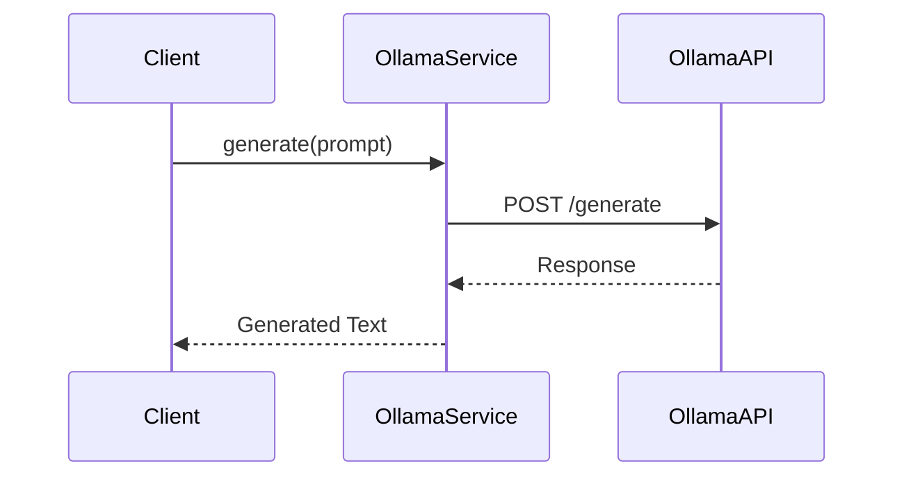
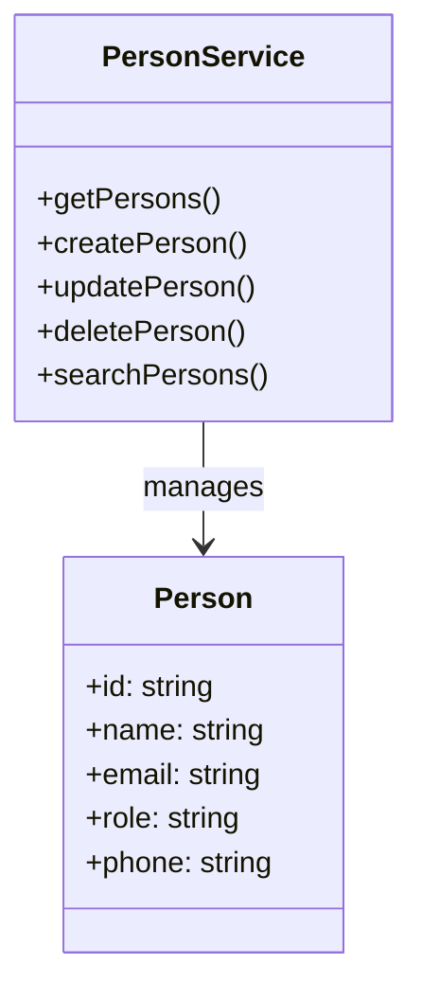

# Services Documentation

## Architecture Globale


## Notion Service

### Description
Le Notion Service permet d'interagir avec l'API Notion pour gérer les bases de données et les pages. Il sert de couche d'abstraction pour les opérations CRUD sur les données stockées dans Notion.

### Fonctionnalités Principales
- Récupération et gestion des bases de données
  - Liste des bases de données avec leurs propriétés
  - Création de nouvelles bases de données
  - Modification du schéma des bases existantes
  - Ajout/suppression de propriétés
- Gestion des entrées
  - Création de nouvelles entrées
  - Mise à jour des entrées existantes
  - Suppression d'entrées
  - Recherche dans les bases de données
- Gestion des relations entre bases de données
- Cache intelligent avec invalidation automatique

### Interfaces et Méthodes

#### getDatabases(): Promise<Array<{name: string; id: string; properties: any}>>
Retourne la liste de toutes les bases de données avec leurs propriétés

#### getDatabaseSchema(databaseId: string): Promise<any>
Récupère le schéma complet d'une base de données spécifique

#### createDatabase(params: {parent_page_id: string; title: string; properties: Record<string, any>}): Promise<any>
Crée une nouvelle base de données avec les propriétés spécifiées

#### addDatabaseProperty(params: {database_id: string; property_name: string; property_config: any}): Promise<any>
Ajoute une nouvelle propriété à une base de données existante

#### removeDatabaseProperty(params: {database_id: string; property_name: string}): Promise<any>
Supprime une propriété d'une base de données

#### createPage(databaseId: string, properties: object): Promise<Page>
Crée une nouvelle page dans la base de données spécifiée

#### updatePage(pageId: string, properties: object): Promise<Page>
Met à jour les propriétés d'une page existante

#### deletePage(pageId: string): Promise<void>
Supprime une page spécifique

#### queryDatabase(databaseId: string, filters?: object): Promise<Page[]>
Effectue une recherche dans une base de données avec des filtres optionnels

### Tests Unitaires
```typescript
describe('Notion Service', () => {
  it('should list databases', async () => {
    const databases = await notionService.getDatabases();
    expect(databases.length).toBeGreaterThan(0);
  });

  it('should create database', async () => {
    const database = await notionService.createDatabase({
      parent_page_id: 'test-page',
      title: 'Test Database',
      properties: {
        Name: { type: 'title', title: {} },
        Description: { type: 'rich_text', rich_text: {} }
      }
    });
    expect(database.id).toBeDefined();
  });

  it('should add property', async () => {
    const result = await notionService.addDatabaseProperty({
      database_id: 'test-db',
      property_name: 'Price',
      property_config: { type: 'number', number: { format: 'euro' } }
    });
    expect(result.properties.Price).toBeDefined();
  });
});
```

### Erreurs Courantes
- **401 Unauthorized** : Vérifier les clés API Notion
- **404 Not Found** : Vérifier les IDs de base de données
- **429 Too Many Requests** : Implémenter un système de retry

### Exemples d'Utilisation

```typescript
// Lister les bases de données
const databases = await notionService.getDatabases();
console.log('Bases disponibles:', databases.map(db => db.name));

// Créer une nouvelle base de données
const newDb = await notionService.createDatabase({
  parent_page_id: 'page-id',
  title: 'Catalogue Produits',
  properties: {
    Name: { type: 'title', title: {} },
    Price: { type: 'number', number: { format: 'euro' } },
    Category: { type: 'select', select: { options: [] } }
  }
});

// Ajouter une propriété
await notionService.addDatabaseProperty({
  database_id: newDb.id,
  property_name: 'Stock',
  property_config: { type: 'number', number: {} }
});

// Supprimer une propriété
await notionService.removeDatabaseProperty({
  database_id: newDb.id,
  property_name: 'Stock'
});

// Voir le schéma d'une base
const schema = await notionService.getDatabaseSchema(newDb.id);
console.log('Propriétés:', Object.keys(schema.properties));

// Créer une nouvelle entrée
const newPage = await notionService.createPage(newDb.id, {
  Name: { title: [{ text: { content: 'Nouveau Produit' } }] },
  Price: { number: 29.99 },
  Category: { select: { name: 'Électronique' } }
});
```

## Ollama Service

### Diagramme de Séquence


### Description
Le Ollama Service permet d'interagir avec les modèles de langage locaux via l'API Ollama. Il fournit une interface pour générer du texte, poser des questions et obtenir des réponses à partir des modèles installés.

### Fonctionnalités Principales
- Liste des modèles disponibles
- Génération de texte
- Chat conversationnel
- Streaming des réponses
- Gestion des contextes de conversation
- Configuration des paramètres des modèles

### Interfaces et Méthodes

#### listModels(): Promise<Model[]>
Retourne la liste des modèles Ollama disponibles localement

#### generate(model: string, prompt: string, options?: object): Promise<string>
Génère une réponse à partir d'un prompt donné en utilisant le modèle spécifié

#### chat(model: string, messages: Array<{role: string, content: string}>, options?: object): Promise<ChatResponse>
Permet d'avoir une conversation avec le modèle spécifié

#### streamGenerate(model: string, prompt: string, callback: (chunk: string) => void): Promise<void>
Génère une réponse en streaming avec un callback pour chaque chunk

### Tests Unitaires
```typescript
describe('Ollama Service', () => {
  it('should list models', async () => {
    const models = await ollamaService.listModels();
    expect(models.length).toBeGreaterThan(0);
  });

  it('should generate text', async () => {
    const response = await ollamaService.generate('llama2', 'Test prompt');
    expect(response.length).toBeGreaterThan(0);
  });
});
```

### Erreurs Courantes
- **Model Not Found** : Vérifier les modèles installés
- **Timeout** : Augmenter le timeout ou optimiser le prompt
- **Memory Error** : Réduire la taille du contexte

### Exemples d'Utilisation

```typescript
// Lister les modèles disponibles
const models = await ollamaService.listModels();

// Générer une réponse avec options
const response = await ollamaService.generate('llama2', 'Explique-moi le machine learning', {
  temperature: 0.7,
  max_tokens: 500
});

// Chat conversationnel avec contexte
const messages = [
  { role: 'system', content: 'Tu es un assistant utile' },
  { role: 'user', content: 'Bonjour, comment vas-tu ?' }
];
const chatResponse = await ollamaService.chat('mistral', messages, {
  temperature: 0.5
});

// Génération en streaming
await ollamaService.streamGenerate('llama2', 'Raconte-moi une histoire', (chunk) => {
  process.stdout.write(chunk);
});
```

## Person Service

### Diagramme de Classes


### Description
Le Person Service gère les opérations liées aux personnes dans l'application. Il sert d'interface pour interagir avec les données des personnes stockées dans Notion.

### Fonctionnalités Principales
- Récupération de la liste des personnes
- Création de nouvelles entrées de personnes
- Mise à jour des informations des personnes
- Suppression de personnes
- Gestion des relations entre personnes
- Recherche avancée de personnes

### Interfaces et Méthodes

#### getPersons(): Promise<Person[]>
Retourne la liste complète des personnes

#### createPerson(personData: object): Promise<Person>
Crée une nouvelle entrée de personne

#### updatePerson(personId: string, updatedData: object): Promise<Person>
Met à jour les informations d'une personne existante

#### deletePerson(personId: string): Promise<void>
Supprime une personne spécifique

#### searchPersons(criteria: object): Promise<Person[]>
Recherche des personnes selon des critères spécifiques

### Tests Unitaires
```typescript
describe('Person Service', () => {
  it('should create person', async () => {
    const person = await personService.createPerson({
      name: 'Test Person'
    });
    expect(person.id).toBeDefined();
  });

  it('should search persons', async () => {
    const results = await personService.searchPersons({
      role: 'Client'
    });
    expect(results.length).toBeGreaterThanOrEqual(0);
  });
});

### Erreurs Courantes
- **Duplicate Entry** : Vérifier les contraintes d'unicité
- **Validation Error** : Vérifier les champs requis
- **Not Found** : Vérifier les IDs de personne

### Exemples d'Utilisation

```typescript
// Récupérer la liste des personnes
const persons = await personService.getPersons();

// Créer une nouvelle personne
const newPerson = await personService.createPerson({
  name: 'Jean Dupont',
  email: 'jean.dupont@example.com',
  role: 'Client',
  phone: '+33123456789'
});

// Mettre à jour une personne
const updatedPerson = await personService.updatePerson('person-id', {
  email: 'nouvel.email@example.com'
});

// Rechercher des personnes
const results = await personService.searchPersons({
  role: 'Client',
  active: true
});
